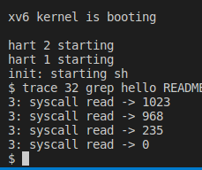
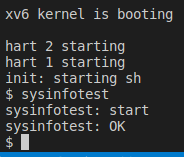

# Syscall

## System call tracing

* remember to add `$U/_trace\` to Makefile. (xv6 print "exec trace failed" again and again, and I debug very hard and into very deep call layer. function namei() return -1 and don't goto "bad" label to process error)
* add trace_mask as proc's property directly. fork doesn't copy all the properties to new process, it need to assign it to a new one manually

## Sysinfo

* I met "succeeded with bad argument", because I use `return 0` directly instead of `return filesysinfo(...)`
* copyout need pagetable, an address, and object to copy. It copies given data to user space.
* user space -> libs defined in user.h --link--> usys.S generated by usys.pl --ecall--> syscall defined in syscall.c --SYS_xxx--> syscall function sys_xxxx

xv6 is a re-implementation of Dennis Ritchie's and Ken Thompson's Unix
Version 6 (v6).  xv6 loosely follows the structure and style of v6,
but is implemented for a modern RISC-V multiprocessor using ANSI C.

ACKNOWLEDGMENTS

xv6 is inspired by John Lions's Commentary on UNIX 6th Edition (Peer
to Peer Communications; ISBN: 1-57398-013-7; 1st edition (June 14,
2000)). See also https://pdos.csail.mit.edu/6.828/, which
provides pointers to on-line resources for v6.

The following people have made contributions: Russ Cox (context switching,
locking), Cliff Frey (MP), Xiao Yu (MP), Nickolai Zeldovich, and Austin
Clements.

We are also grateful for the bug reports and patches contributed by
Takahiro Aoyagi, Silas Boyd-Wickizer, Anton Burtsev, Ian Chen, Dan
Cross, Cody Cutler, Mike CAT, Tej Chajed, Asami Doi, eyalz800, Nelson
Elhage, Saar Ettinger, Alice Ferrazzi, Nathaniel Filardo, flespark,
Peter Froehlich, Yakir Goaron,Shivam Handa, Matt Harvey, Bryan Henry,
jaichenhengjie, Jim Huang, Matúš Jókay, Alexander Kapshuk, Anders
Kaseorg, kehao95, Wolfgang Keller, Jungwoo Kim, Jonathan Kimmitt,
Eddie Kohler, Vadim Kolontsov , Austin Liew, l0stman, Pavan
Maddamsetti, Imbar Marinescu, Yandong Mao, , Matan Shabtay, Hitoshi
Mitake, Carmi Merimovich, Mark Morrissey, mtasm, Joel Nider,
OptimisticSide, Greg Price, Jude Rich, Ayan Shafqat, Eldar Sehayek,
Yongming Shen, Fumiya Shigemitsu, Cam Tenny, tyfkda, Warren Toomey,
Stephen Tu, Rafael Ubal, Amane Uehara, Pablo Ventura, Xi Wang, Keiichi
Watanabe, Nicolas Wolovick, wxdao, Grant Wu, Jindong Zhang, Icenowy
Zheng, ZhUyU1997, and Zou Chang Wei.

The code in the files that constitute xv6 is
Copyright 2006-2020 Frans Kaashoek, Robert Morris, and Russ Cox.

ERROR REPORTS

Please send errors and suggestions to Frans Kaashoek and Robert Morris
(kaashoek,rtm@mit.edu). The main purpose of xv6 is as a teaching
operating system for MIT's 6.S081, so we are more interested in
simplifications and clarifications than new features.

BUILDING AND RUNNING XV6

You will need a RISC-V "newlib" tool chain from
https://github.com/riscv/riscv-gnu-toolchain, and qemu compiled for
riscv64-softmmu. Once they are installed, and in your shell
search path, you can run "make qemu".
